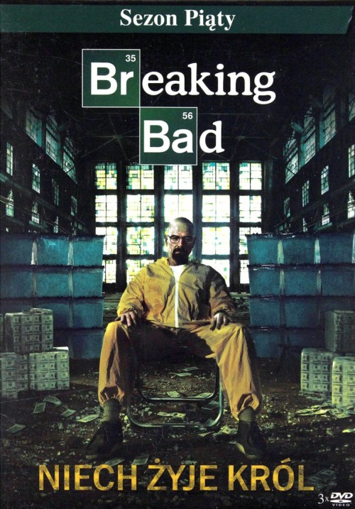

```{r}
---
title: "Breaking Bad Viewership Analysis"
author: "Paidamoyo Simba"
date: "`r Sys.Date()`"
output: html_document


```

# *Breaking Bad*

**Breaking Bad** is an American television drama series created by *Vince Gilligan*. It aired from **2008 to 2013** and starred **Bryan Cranston** as Walter White, a chemistry teacher turned methamphetamine producer, and **Aaron Paul** as his former student and business partner Jesse Pinkman.

The show received critical acclaim for its writing, acting, and cinematography, and is considered one of the greatest television series of all time.

## Logo


